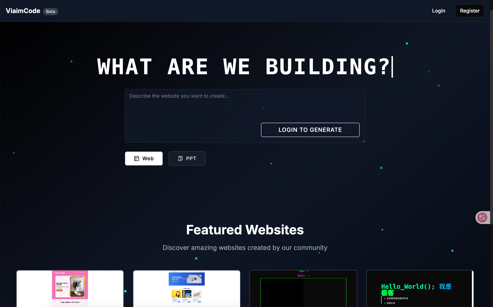

# viaimCode AI - Open Source Version

**开箱即用的AI驱动网站和PPT生成平台** | AI-powered Website & PPT Generator (Open Source)

一个基于Next.js构建的智能内容生成平台，支持通过AI生成现代化网站和专业PPT演示文稿。

[](https://opensource.org/licenses/MIT)
[](https://nodejs.org/)
[](https://nextjs.org/)
[](https://www.typescriptlang.org/)



## 🌟 项目特色

### 🚀 完全开源
- **MIT许可证**: 完全自由使用、修改和分发
- **社区驱动**: 欢迎贡献代码、提出建议
- **透明开发**: 所有开发过程公开透明

### 🎯 核心功能

#### 🌐 AI网站生成
- **智能代码生成**: 基于自然语言描述生成完整的HTML/CSS/JS代码
- **实时预览**: 支持桌面、平板、手机多设备预览
- **多种编辑模式**: 支持选中直接编辑、元素对话编辑、Nocode可视化编辑
- **版本管理**: 自动保存历史版本，支持回滚和对比
- **一键分享**: 支持导出和在线分享

#### 📊 AI PPT生成
- **智能大纲**: AI自动生成演示文稿结构和内容大纲
- **专业设计**: 现代化PPT模板，支持数据可视化
- **交互式编辑**: 支持幻灯片内容的智能修改和优化
- **多格式导出**: 支持PDF、PPTX等格式导出
- **公开分享**: PPT广场展示和分享功能

## 🛠️ 技术栈

- **前端框架**: Next.js 15.2.4 (App Router)
- **开发语言**: TypeScript
- **样式框架**: Tailwind CSS
- **UI组件**: Radix UI + 自定义组件
- **数据库**: MySQL 8.0+
- **AI集成**: 支持多种AI提供商 (DeepSeek, Moonshot, OpenAI等)
- **文件存储**: 阿里云OSS (可选)
- **容器化**: Docker & Docker Compose

## 🚀 快速开始

### 方式一：Docker 部署（推荐新手）

1. **克隆项目**
```bash
git clone https://github.com/your-username/viaimcode-ai.git
cd viaimcode-ai
```

2. **配置环境变量**
```bash
cp env.example .env.local
cp env.example .env
# 编辑环境变量文件
```

3. **启动服务**
```bash
docker-compose up -d
```

4. **访问应用**
打开浏览器访问 http://localhost:3000

### 方式二：本地开发

#### 环境要求
- Node.js 18+
- MySQL 8.0+
- npm 或 yarn

#### 安装步骤

1. **克隆并安装**
```bash
git clone https://github.com/your-username/viaimcode-ai.git
cd viaimcode-ai
npm install
```

2. **数据库设置**
```bash
# 创建数据库
mysql -u root -p -e "CREATE DATABASE localsite_ai;"
# 导入表结构
mysql -u root -p localsite_ai < localsite_ai.sql
```

3. **环境配置**
```bash
cp env.example .env.local
# 编辑 .env.local 文件
```

必需配置项：
```env
# 数据库配置
DB_HOST=localhost
DB_PORT=3306
DB_USER=root
DB_PASSWORD=your_password
DB_NAME=localsite_ai

# AI提供商配置（必需）
DEEPSEEK_API_KEY=your_deepseek_key
MOONSHOT_API_KEY=your_moonshot_key

# 存储配置（可选，用于图片上传）
ALICLOUD_OSS_ENDPOINT=your_oss_endpoint
ALICLOUD_ACCESS_KEY_ID=your_access_key
ALICLOUD_ACCESS_KEY_SECRET=your_secret_key
ALICLOUD_OSS_BUCKET=your_bucket_name
```

4. **启动开发服务器**
```bash
npm run dev
```

## 📖 详细文档

### API文档
- [网站生成API](./docs/api/website-generation.md)
- [PPT生成API](./docs/api/ppt-generation.md)
- [用户认证API](./docs/api/authentication.md)

### 开发指南
- [项目架构](./docs/architecture.md)
- [组件开发](./docs/component-development.md)
- [数据库设计](./docs/database-schema.md)

## 🤝 参与贡献

我们非常欢迎社区贡献！请查看 [贡献指南](CONTRIBUTING.md) 了解如何参与。

### 贡献方式
- 🐛 报告Bug
- 💡 提出功能建议
- 📝 改进文档
- 🔧 提交代码
- 🌐 翻译项目

### 开发流程
1. Fork 项目
2. 创建功能分支
3. 提交更改
4. 发起 Pull Request

## 🛣️ 发展路线

### 短期目标 (Q1 2025)
- [ ] 支持更多AI提供商
- [ ] 改进移动端体验
- [ ] 增加更多PPT模板
- [ ] 性能优化

### 中期目标 (Q2-Q3 2025)
- [ ] 插件系统
- [ ] 多语言支持
- [ ] 团队协作功能
- [ ] API开放平台

### 长期目标 (Q4 2025+)
- [ ] 桌面客户端
- [ ] 移动应用
- [ ] 企业级功能
- [ ] 生态系统建设

## 🏆 贡献者

感谢所有为这个项目做出贡献的开发者！

<!-- 这里会自动显示贡献者头像 -->
<a href="https://github.com/your-username/viaimcode-ai/graphs/contributors">
  
</a>

## 📊 项目统计


## 🔗 相关链接

- **官方网站**: [webcode.weilai.ai](https://webcode.weilai.ai)
- **文档站点**: [docs.viaimcode.ai](https://docs.viaimcode.ai) (即将上线)
- **问题反馈**: [GitHub Issues](https://github.com/your-username/viaimcode-ai/issues)
- **讨论区**: [GitHub Discussions](https://github.com/your-username/viaimcode-ai/discussions)

## 📄 许可证

本项目基于 [MIT License](LICENSE) 开源。

## 🙏 致谢

- 感谢所有贡献者的辛勤付出
- 感谢开源社区的支持和反馈
- 特别感谢以下项目的启发：
  - [Next.js](https://nextjs.org/) - React框架
  - [Tailwind CSS](https://tailwindcss.com/) - CSS框架
  - [Radix UI](https://www.radix-ui.com/) - UI组件库

## 💬 联系我们

- **邮箱**: opensource@viaimcode.ai
- **Twitter**: [@viaimcode](https://twitter.com/viaimcode)
- **微信群**: 添加微信号 `viaimcode-bot` 加入讨论群

---

**如果这个项目对你有帮助，请给我们一个 ⭐ Star！**

Made with ❤️ by the viaimCode AI Team 