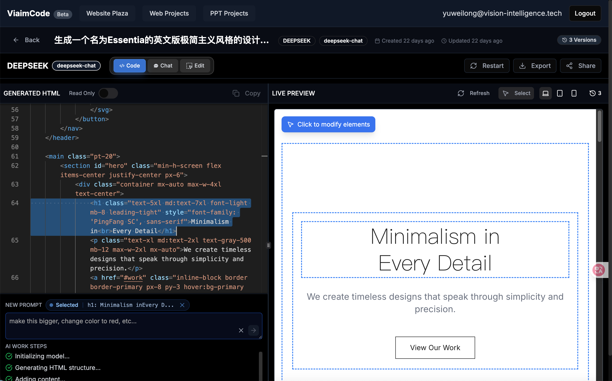
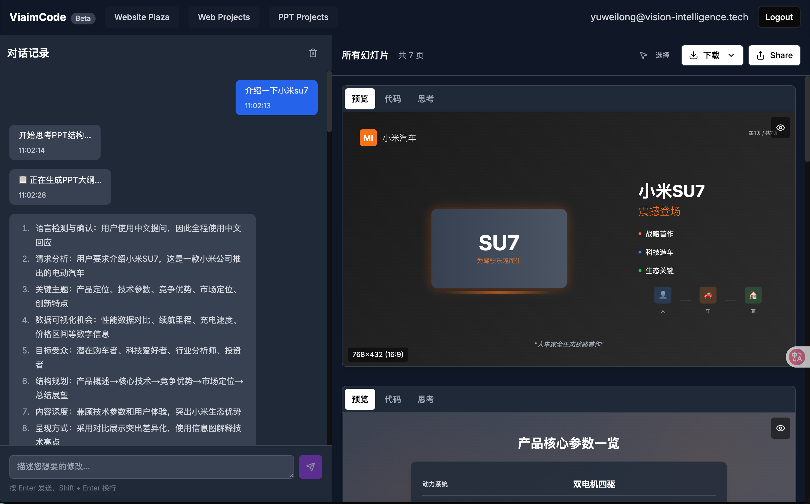

# viaimCode AI
### 开箱即用的 webcode 项目
**体验地址**: [https://webcode.weilai.ai](https://webcode.weilai.ai)

**AI驱动的网站和PPT生成平台** | AI-powered Website & PPT Generator

一个基于Next.js构建的智能内容生成平台，支持通过AI生成现代化网站和专业PPT演示文稿。




## ✨ 功能特点

### 🌐 AI网站生成
- **智能代码生成**: 基于自然语言描述生成完整的HTML/CSS/JS代码
- **实时预览**: 支持桌面、平板、手机多设备预览
- **多种编辑模式**: 支持选中直接编辑、元素对话编辑、Nocode可视化编辑
- **可视化编辑**: 内置代码编辑器，支持实时修改
- **版本管理**: 自动保存历史版本，支持回滚和对比
- **一键部署**: 支持导出和在线分享

### 📊 AI PPT生成
- **智能大纲**: AI自动生成演示文稿结构和内容大纲
- **专业设计**: 现代化PPT模板，支持数据可视化
- **交互式编辑**: 支持幻灯片内容的智能修改和优化
- **多格式导出**: 支持PDF、PPTX等格式导出
- **公开分享**: PPT广场展示和分享功能

### 🔧 技术特性

- **响应式设计**: 完全适配移动端和桌面端
- **用户系统**: 完整的用户注册、登录、项目管理
- **云存储**: 支持阿里云OSS图片存储
- **Docker部署**: 一键容器化部署

## 🚀 快速开始

### 方式一：Docker 部署（推荐）

1. **克隆项目**
```bash
git clone https://github.com/your-username/LocalSite-ai.git
cd LocalSite-ai
```

2. **配置环境变量**

    注意: 目前项目必须填写deepseek的key用于生成单个网页、moonshot的key用于生成ppt
```bash
cp env.example .env.local 
cp env.example .env
# 编辑 .env.local .env文件，填入你的配置
```

3. **启动服务**
```bash
docker-compose up -d
```

4. **初始化数据库**
```bash
# 数据库会自动创建，也可以手动导入
mysql -u root -p localsite_ai < localsite_ai.sql
```

5. **访问应用**
打开浏览器访问 http://localhost:3000

### 方式二：本地开发

#### 环境要求
- Node.js 18+
- MySQL 8.0+
- npm 或 yarn

#### 安装步骤

1. **安装依赖**
```bash
npm install
```

2. **配置环境变量**
```bash
cp env.example .env.local
cp env.example .env
```

必需配置项：
```env
# 数据库配置
DB_HOST=localhost
DB_PORT=3306
DB_USER=root
DB_PASSWORD=your_password
DB_NAME=localsite_ai

# AI提供商配置（moonshot和deepseek目前都需要配置,在htmlk生成部分采用了deepseekV3,在ppt生成部分使用了moonshotK2）
MOONSHOT_API_KEY=your_moonshot_key
DEEPSEEK_API_KEY=your_deepseek_key
```

3. **初始化数据库**
```bash
# 创建数据库
mysql -u root -p -e "CREATE DATABASE localsite_ai;"

# 导入表结构
mysql -u root -p localsite_ai < localsite_ai.sql

# 或者使用内置脚本
npm run init-db
```

4. **启动开发服务器**
```bash
npm run dev
```

## 🛠️ 配置说明

### AI 提供商配置

项目支持多种AI提供商，可以根据需要选择：
必填项目
#### Deepseek
```env
DEEPSEEK_API_KEY=sk-your-key-here
DEEPSEEK_API_BASE=https://api.openai.com/v1
```
#### MOONSHOT
```env
MOONSHOT_API_KEY=sk-your-key-here
MOONSHOT_API_Base  目前写死了,可以忽略
```
--------------
选填项目


#### OpenAI
```env
OPENAI_API_KEY=sk-your-key-here
OPENAI_API_BASE=https://api.openai.com/v1
```

#### Anthropic Claude
```env
ANTHROPIC_API_KEY=your-key-here
```

#### 本地AI (Ollama)
```env
OLLAMA_API_BASE=http://localhost:11434
```

#### LM Studio
```env
LM_STUDIO_API_BASE=http://localhost:1234/v1
```

### 存储配置


#### 阿里云OSS（推荐生产环境）
```env
ALICLOUD_ACCESS_KEY_ID=your_key_id
ALICLOUD_ACCESS_KEY_SECRET=your_key_secret
ALICLOUD_OSS_BUCKET=your_bucket_name
ALICLOUD_OSS_REGION=oss-cn-hangzhou
```

## 📁 项目结构

```
LocalSite-ai/
├── app/                    # Next.js App Router
│   ├── (main)/            # 主应用页面
│   ├── (share)/           # 分享页面
│   ├── api/               # API路由
│   └── globals.css        # 全局样式
├── components/            # React组件
│   ├── ui/               # UI基础组件
│   └── ...               # 业务组件
├── lib/                  # 工具库
│   ├── db.ts             # 数据库连接
│   ├── auth.ts           # 认证逻辑
│   └── ...               # 其他工具
├── public/               # 静态资源
├── scripts/              # 数据库脚本
├── docker-compose.yml    # Docker配置
└── package.json          # 项目依赖
```

## 🔧 开发指南

### 添加新的AI提供商

1. 在 `lib/providers/` 中创建新的提供商配置
2. 更新 `lib/providers/config.ts` 添加配置
3. 在前端组件中添加选择选项

### 自定义PPT模板

1. 修改 `app/api/generate-ppt-html/route.ts` 中的模板
2. 调整CSS样式和布局
3. 测试不同内容类型的显示效果

### 数据库迁移

使用 `scripts/` 目录中的SQL文件进行数据库结构更新：

```bash
mysql -u root -p localsite_ai < scripts/your-migration.sql
```

## 🚢 部署指南

### Docker 部署

1. **构建镜像**
```bash
docker build -t localsite-ai .
```

2. **使用docker-compose**
```bash
docker-compose up -d
```

### Vercel 部署

1. 连接GitHub仓库到Vercel
2. 配置环境变量
3. 设置数据库连接（推荐使用PlanetScale或AWS RDS）

### 传统服务器部署

1. **构建生产版本**
```bash
npm run build
```

2. **启动应用**
```bash
npm start
```

3. **使用PM2管理进程**
```bash
pm2 start npm --name "localsite-ai" -- start
```

## 🤝 贡献指南

欢迎贡献代码！请遵循以下步骤：

1. Fork 本仓库到你的 GitHub 账号
2. 新建一个功能分支（`git checkout -b feature/你的功能名`）
3. 完成开发后提交代码（`git commit -m 'feat: 实现 XXX 功能'`）
4. 将分支推送到你的远程仓库（`git push origin feature/你的功能名`）
5. 开启 Pull Request

### 开发规范

- 使用 TypeScript 进行类型检查
- 遵循 ESLint 规则
- 组件使用函数式组件和 Hooks
- API 路由使用 Next.js App Router 规范

## 📄 许可证

本项目采用 MIT 许可证。详见 [LICENSE](LICENSE) 文件。
## 🔗 相关链接

- [在线演示](https://webcode.weilai.ai)

- [问题反馈(飞书)](https://applink.feishu.cn/client/chat/chatter/add_by_link?link_token=108mb75b-4cf3-4621-8eb2-c69eefc43fe2)

## ⭐ 支持项目

如果这个项目对你有帮助，请给我们一个 ⭐ Star！

---
thanks by [未来智能](https://www.viaim.cn/#/home) 

