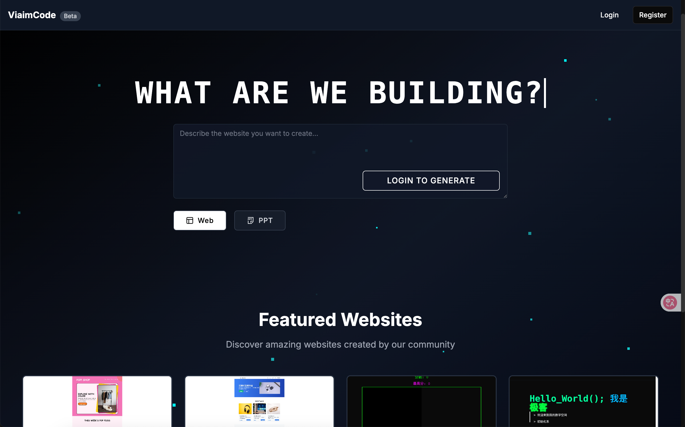

# viaimCode AI

<div align="center">

**🌐 Language / 语言**  
[English](README.md) | [中文](README-zh.md)

[](https://opensource.org/licenses/MIT)
[](https://nodejs.org/)
[](https://nextjs.org/)
[](https://www.typescriptlang.org/)

**AI-powered Website & PPT Generator**

*An intelligent content generation platform built with Next.js, supporting AI-generated modern websites and professional PPT presentations.*

**🌟 [Live Demo](https://webcode.weilai.ai) | 📖 [Documentation](docs/) | 🚀 [Quick Start](#-quick-start)**

</div>



## ✨ Features

### 🌐 AI Website Generation
- **Smart Code Generation**: Generate complete HTML/CSS/JS code from natural language descriptions
- **Real-time Preview**: Support for desktop, tablet, and mobile device previews
- **Multiple Edit Modes**: Direct selection editing, element dialog editing, and visual no-code editing
- **Visual Editor**: Built-in code editor with real-time modification support
- **Version Control**: Automatic history saving with rollback and comparison features
- **One-click Deployment**: Export and online sharing support

### 📊 AI PPT Generation
- **Smart Outline**: AI-generated presentation structure and content outlines
- **Professional Design**: Modern PPT templates with data visualization support
- **Interactive Editing**: Smart modification and optimization of slide content
- **Multi-format Export**: Support for PDF, PPTX, and other format exports
- **Public Sharing**: PPT plaza for showcasing and sharing presentations

### 🔧 Technical Features
- **Responsive Design**: Fully adapted for mobile and desktop
- **User System**: Complete user registration, login, and project management
- **Cloud Storage**: Alibaba Cloud OSS image storage support
- **Docker Deployment**: One-click containerized deployment

## 🚀 Quick Start

### Method 1: Docker Deployment (Recommended)

1. **Clone the project**
```bash
git clone https://github.com/Mrkk1/viaimcode.git
cd LocalSite-ai
```

2. **Configure environment variables**
```bash
cp env.example .env.local 
cp env.example .env
# Edit .env.local and .env files with your configuration
```

> **Note**: Currently, the project requires DeepSeek API key for webpage generation and Moonshot API key for PPT generation.

3. **Start services**
```bash
docker-compose up -d
```

4. **Initialize database**
```bash
# Database will be created automatically, or import manually
mysql -u root -p localsite_ai < localsite_ai.sql
```

5. **Access the application**
Open your browser and visit http://localhost:3000

### Method 2: Local Development

#### Requirements
- Node.js 18+
- MySQL 8.0+
- npm or yarn

#### Installation Steps

1. **Install dependencies**
```bash
npm install
```

2. **Configure environment variables**
```bash
cp env.example .env.local
cp env.example .env
```

Required configuration:
```env
# Database configuration
DB_HOST=localhost
DB_PORT=3306
DB_USER=root
DB_PASSWORD=your_password
DB_NAME=localsite_ai

# AI provider configuration (both required)
MOONSHOT_API_KEY=your_moonshot_key
DEEPSEEK_API_KEY=your_deepseek_key
```

3. **Initialize database**
```bash
# Create database
mysql -u root -p -e "CREATE DATABASE localsite_ai;"

# Import table structure
mysql -u root -p localsite_ai < localsite_ai.sql

# Or use built-in script
npm run init-db
```

4. **Start development server**
```bash
npm run dev
```

## 🛠️ Configuration

### AI Provider Configuration

The project supports multiple AI providers. Required configurations:

#### DeepSeek (Required)
```env
DEEPSEEK_API_KEY=sk-your-key-here
DEEPSEEK_API_BASE=https://api.deepseek.com/v1
```

#### Moonshot (Required)
```env
MOONSHOT_API_KEY=sk-your-key-here
```

#### Optional Providers

**OpenAI**
```env
OPENAI_API_KEY=sk-your-key-here
OPENAI_API_BASE=https://api.openai.com/v1
```

**Anthropic Claude**
```env
ANTHROPIC_API_KEY=your-key-here
```

**Local AI (Ollama)**
```env
OLLAMA_API_BASE=http://localhost:11434
```

**LM Studio**
```env
LM_STUDIO_API_BASE=http://localhost:1234/v1
```

### Storage Configuration

#### Alibaba Cloud OSS (Recommended for production)
```env
ALICLOUD_ACCESS_KEY_ID=your_key_id
ALICLOUD_ACCESS_KEY_SECRET=your_key_secret
ALICLOUD_OSS_BUCKET=your_bucket_name
ALICLOUD_OSS_REGION=oss-cn-hangzhou
```

## 📁 Project Structure

```
LocalSite-ai/
├── app/                    # Next.js App Router
│   ├── (main)/            # Main application pages
│   ├── (share)/           # Sharing pages
│   ├── api/               # API routes
│   └── globals.css        # Global styles
├── components/            # React components
│   ├── ui/               # Base UI components
│   └── ...               # Business components
├── lib/                  # Utility libraries
│   ├── db.ts             # Database connection
│   ├── auth.ts           # Authentication logic
│   └── ...               # Other utilities
├── public/               # Static assets
├── scripts/              # Database scripts
├── docker-compose.yml    # Docker configuration
└── package.json          # Project dependencies
```

## 🔧 Development Guide

### Adding New AI Providers

1. Create new provider configuration in `lib/providers/`
2. Update `lib/providers/config.ts` to add configuration
3. Add selection options in frontend components

### Custom PPT Templates

1. Modify templates in `app/api/generate-ppt-html/route.ts`
2. Adjust CSS styles and layouts
3. Test display effects for different content types

### Database Migration

Use SQL files in the `scripts/` directory for database structure updates:

```bash
mysql -u root -p localsite_ai < scripts/your-migration.sql
```

## 🚢 Deployment Guide

### Docker Deployment

1. **Build image**
```bash
docker build -t localsite-ai .
```

2. **Use docker-compose**
```bash
docker-compose up -d
```

### Vercel Deployment

1. Connect GitHub repository to Vercel
2. Configure environment variables
3. Set up database connection (recommend PlanetScale or AWS RDS)

### Traditional Server Deployment

1. **Build production version**
```bash
npm run build
```

2. **Start application**
```bash
npm start
```

3. **Use PM2 for process management**
```bash
pm2 start npm --name "localsite-ai" -- start
```

## 🤝 Contributing

We welcome contributions! Please follow these steps:

1. Fork this repository to your GitHub account
2. Create a feature branch (`git checkout -b feature/your-feature-name`)
3. Commit your changes (`git commit -m 'feat: implement XXX feature'`)
4. Push the branch to your remote repository (`git push origin feature/your-feature-name`)
5. Open a Pull Request

### Development Standards

- Use TypeScript for type checking
- Follow ESLint rules
- Use functional components and Hooks
- Follow Next.js App Router conventions for API routes

## 🐛 Troubleshooting

### Common Issues

**Database Connection Error**
- Check if MySQL service is running
- Verify database credentials in `.env.local`
- Ensure database `localsite_ai` exists

**AI API Errors**
- Verify API keys are correctly configured
- Check API rate limits and quotas
- Ensure network connectivity to AI providers

**Docker Issues**
- Make sure Docker and Docker Compose are installed
- Check port 3000 is not occupied by other services
- Verify environment variables in docker-compose.yml

For more troubleshooting tips, see [TROUBLESHOOTING.md](docs/TROUBLESHOOTING.md)

## 📄 License

This project is licensed under the MIT License. See the [LICENSE](LICENSE) file for details.

## 🔗 Links

- [Live Demo](https://webcode.weilai.ai)
- [Documentation](docs/)
- [Issue Tracker](https://github.com/Mrkk1/viaimcode/issues)
- [Feedback (Feishu)](https://applink.feishu.cn/client/chat/chatter/add_by_link?link_token=108mb75b-4cf3-4621-8eb2-c69eefc43fe2)

## ⭐ Support the Project

If this project helps you, please give us a ⭐ Star!

---

<div align="center">

**Made with  by [未来智能 | viaim](https://www.viaim.cn/#/home)**

</div> 

